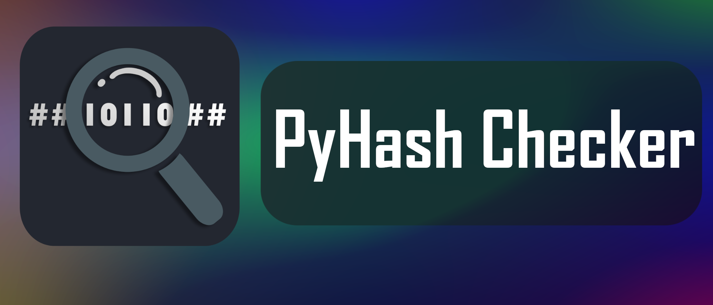
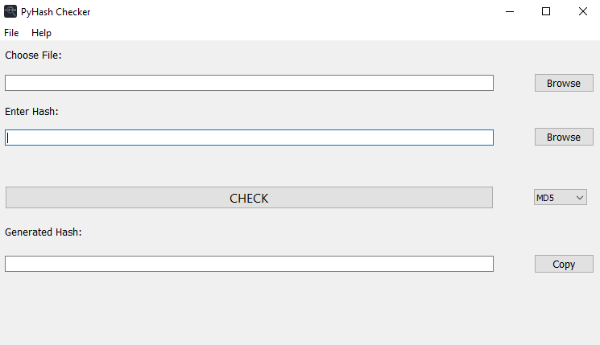

# PyHash Checker
---
### PyHash Checker is a utility app to check the cryptographic checksum of a file.
Generates the hash of a file and compares it with the hash entered.

# Algorithms Available
---
- MD5
- SHA 1
- SHA 224
- SHA 256
- SHA 384
- SHA 512

# GUI
---

# Download
---
Download the executable file from the [Releases](https://github.com/PixelRBN/PyHash-Checker/releases) Page
